# Control flow for iharm2d v4 

```mermaid
flowchart TD
    Start["Start"]
    main_read["<code>main()</code><br/><small>Read command line arguments</small>"]
    read_params["<code>read_params()</code><br/><small>Set runtime parameters</small>"]
    main_dirs["<code>main()</code><br/><small>Make dump and restart directories, set number of OpenMP threads</small>"]
    restart_check{"Restart file exists?"}
    restart_init["<code>restart_init()</code><br/><small>Read restart file, set <code>GridGeom</code> struct <code>G</code> and <code>FluidState</code> struct <code>S</code></small>"]
    init["<code>init()</code><br/><small>Initialize Fishbone-Moncrief torus, set <code>GridGeom</code> struct <code>G</code> and <code>FluidState</code> struct <code>S</code></small>"]
    main_loop["<code>main()</code><br>Integrate until user-provided timestamp <code>tf</code><br>while t &leq; tf"]
    step_save["<code>step()</code><br/>Save a copy of primitive variables in <code>FluidState S</code> in <code>Ssave</code>; will be used for computing the 4-current at the end of the substep."]
    advance1["<code>advance_fluid()</code><br/>Advance fluid state by half timestep (0.5*dt). <code>Sf</code>→P=Si→P."]
    get_flux["<code>get_flux()</code><br/><small>Allocate memory for Sl, Sr</small>"]
    reconstruct["<code>reconstruct()</code><br/><small>Compute Pl and Pr</small>"]
    lr_to_flux["<code>lr_to_flux()</code><br/><small>Ul, Ur, Fl, Fr from Pl, Pr<br/>Compute ctop and LLF flux F</small>"]
    advance2["<code>advance_fluid()</code><br/><small>Return dt for corrector step</small>"]
    fix_flux["<code>fix_flux()</code><br/><small>No F→X2 at poles, no inflow flux</small>"]
    flux_ct["<code>flux_ct()</code><br/><small>Flux-interpolated CT reset</small>"]
    get_source["<code>get_fluid_source()</code><br/><small>Compute source term dU</small>"]
    advance3["<code>advance_fluid()</code><br/><small>Obtain Si→U, update Sf→P<br/>Obtain Sf→U via u_to_p()</small>"]
    step_post["<code>step()</code><br/><small>Heat electrons, fixups<br/>Boundary conditions, corrector</small>"]
    dump_check{"Writing dump file?"}
    current_calc["<code>current_calc()</code><br/><small>Compute S→jcon</small>"]
    increment["t += dt"]
    main_write["<code>main()</code><br/><small>Write dump/restart if conditions met</small>"]
    loop_check{"t &lt; tf?"}
    Stop["Stop"]

    Start --> main_read
    main_read --> read_params
    read_params --> main_dirs
    main_dirs --> restart_check
    restart_check -->|Yes| restart_init
    restart_check -->|No| init
    restart_init --> main_loop
    init --> main_loop
    main_loop --> step_save
    step_save --> advance1
    advance1 --> get_flux
    get_flux --> reconstruct
    reconstruct --> lr_to_flux
    lr_to_flux --> advance2
    advance2 --> fix_flux
    fix_flux --> flux_ct
    flux_ct --> get_source
    get_source --> advance3
    advance3 --> step_post
    step_post --> dump_check
    dump_check -->|Yes| current_calc
    dump_check -->|No| increment
    current_calc --> increment
    increment --> main_write
    main_write --> loop_check
    loop_check -->|Yes| step_save
    loop_check -->|No| Stop

    %% main.c — purple 200
    style main_read fill:#AFA9EC,stroke:#444,color:#26215C
    style main_dirs fill:#AFA9EC,stroke:#444,color:#26215C
    style main_loop fill:#AFA9EC,stroke:#444,color:#26215C
    style main_write fill:#AFA9EC,stroke:#444,color:#26215C

    %% parameters.c — pink 200
    style read_params fill:#ED93B1,stroke:#444,color:#4B1528

    %% step.c — teal 200
    style step_save fill:#5DCAA5,stroke:#444,color:#04342C
    style advance1 fill:#5DCAA5,stroke:#444,color:#04342C
    style advance2 fill:#5DCAA5,stroke:#444,color:#04342C
    style advance3 fill:#5DCAA5,stroke:#444,color:#04342C
    style step_post fill:#5DCAA5,stroke:#444,color:#04342C

    %% fluxes.c — coral 200
    style get_flux fill:#F0997B,stroke:#444,color:#4A1B0C
    style reconstruct fill:#F0997B,stroke:#444,color:#4A1B0C
    style lr_to_flux fill:#F0997B,stroke:#444,color:#4A1B0C
    style flux_ct fill:#F0997B,stroke:#444,color:#4A1B0C

    %% bounds.c — blue 200
    style fix_flux fill:#85B7EB,stroke:#444,color:#042C53

    %% phys.c — green 200
    style get_source fill:#97C459,stroke:#444,color:#173404

    %% restart.c / problem.c / current.c — amber 200
    style restart_init fill:#FAC775,stroke:#444,color:#412402
    style init fill:#FAC775,stroke:#444,color:#412402
    style current_calc fill:#FAC775,stroke:#444,color:#412402

    %% Decisions — red 200
    style restart_check fill:#F09595,stroke:#444,color:#501313
    style dump_check fill:#F09595,stroke:#444,color:#501313
    style loop_check fill:#F09595,stroke:#444,color:#501313

    %% Start / Stop — gray 200
    style Start fill:#B4B2A9,stroke:#444,color:#2C2C2A
    style Stop fill:#B4B2A9,stroke:#444,color:#2C2C2A

    %% Neutral
    style increment fill:#B4B2A9,stroke:#444,color:#2C2C2A
```

| Color | Source file |
|-------|------------|
|  | main.c |
|  | parameters.c |
|  | step.c |
|  | fluxes.c |
|  | bounds.c |
|  | phys.c |
|  | restart.c / problem.c / current.c |
|  | decisions |
|  | start / stop / neutral |