# Control flow and `FluidState` mapping

This page provides an overview of the `iharm` control flow, color-coded by source file, followed by a reference for `FluidState` usage across functions. The flowchart shows the sequence of function calls from initialization through the main integration loop. The `FluidState` reference documents how `FluidState` structs are passed, aliased, and modified as control flows from caller to callee — each function's entry lists its parameters, local states, and outgoing calls with the arguments passed. Only functions that receive or define more than one `FluidState` are listed — single-state functions, e.g., like `fixup()` or `prim_to_flux()` are straightforward and omitted for brevity.

### `iharm` control flow

```mermaid
flowchart TD
    Start["Start"]
    main_read["<code>main()</code><br/><small>Read command line arguments.</small>"]
    read_params["<code>read_params()</code><br/><small>Set runtime parameters.</small>"]
    main_dirs["<code>main()</code><br/><small>Make dump and restart directories, set number of OpenMP threads.</small>"]
    restart_check{"Restart file exists?"}
    restart_init["<code>restart_init()</code><br/><small>Read restart file, set <code>GridGeom</code> struct <code>G</code> and <code>FluidState</code> struct <code>S</code>.</small>"]
    init["<code>init()</code><br/><small>Initialize Fishbone-Moncrief torus, set <code>GridGeom</code> struct <code>G</code> and <code>FluidState</code> struct <code>S</code>.</small>"]
    main_loop["<code>main()</code><br><small>Integrate until user-provided timestamp <code>tf</code></small><br>while t &leq; tf."]
    step_save["<code>step()</code><br/><small>Driver function.</small>"]
    advance1["<code>advance_fluid()</code><br/><small>Advance fluid state by half timestep (0.5*<code>dt</code>).</small>"]
    get_flux["<code>get_flux()</code>"]
    reconstruct["<code>reconstruct()</code><br/><small>Reconstruct left (<code>Pl</code>) and right (<code>Pr</code>) primitives at zone faces.</small>"]
    lr_to_flux["<code>lr_to_flux()</code><br/><small>Compute left (<code>Fl</code>) and right (<code>Fr</code>) fluxes, evaluate wavespeed (<code>ctop</code>), and LLF flux (<code>F</code>).</small>"]
    ndt_min["<code>ndt_min()</code><br/><small>Compute timestep <code>dt_min</code>.</small>"]
    advance2["<code>advance_fluid()</code>"]
    fix_flux["<code>fix_flux()</code><br/><small>Ensure 1. no ingoing rest-mass flux at radial boundaries, 2. no flux across polar boundaries, 3. X1 flux of B2 is anti-reflected across the poles.</small>"]
    flux_ct["<code>flux_ct()</code><br/><small>Rewrite magnetic fluxes to preserve corner-centered representation of divB following flux-CT (Toth 2000).</small>"]
    get_source["<code>get_fluid_source()</code><br/><small>Compute source term <code>dU</code></small>"]
    advance3["<code>advance_fluid()</code><br/><small>Compute the end-of-substep conserved variables <code>U</code>.</small>"]
    u_to_p["<code>U_to_P()</code><br/><small>Compute end-of-substep primitive variables  <code>P</code> using the 1Dw scheme.</small>"]
    step_post["<code>step()</code>"]
    electrons_check{"Are electrons being tracked passively?"}
    heat_electrons["<code>heat_electrons()</code><br/><small>Update electron entropy based on subgrid heating prescription chosen.</small>"]
    apply_floors["<code>fixup()</code><br/><small>Apply numerical floors and track any added material by updating <code>fflag</code>.</small>"]
    apply_bounds["<code>set_bounds()</code><br/><small>Apply boundary conditions along X1 and X2.</small>"]
    fix_utop_failures["<code>fixup_utoprim()</code><br/><small>Replace U-to-P inversion failures with weighted interpolation from neighbors.</small>"]
    apply_bounds_again["<code>set_bounds()</code><br/><small>Apply boundary conditions along X1 and X2. An additional pass is needed to propagate updates from the fixup of U-to-P failures.</small>"]
    step_corrector["<code>step()</code><br/><small>Perform the corrector step. This follows the same sequence of operations as above, but advances the fluid state by the full timestep (<code>dt</code>).</small><br/><small><code>t += dt</code></small>"]
    dump_check{"Is a dump file going to written at the end of this time step?<br/><code>if (t >= tdump)</code>"}
    current_calc["<code>current_calc()</code><br/><small>Compute four current <code>jcon</code></small>"]
    main_write["<code>main()</code><br/><small>Update timestep counter <br/>Write dump/restart if conditions are met.</small>"]
    loop_check{"t &lt; tf?"}
    Stop["Stop"]

    Start --> main_read
    main_read --> read_params
    read_params --> main_dirs
    main_dirs --> restart_check
    restart_check -->|Yes| restart_init
    restart_check -->|No| init
    restart_init --> main_loop
    init --> main_loop
    main_loop --> step_save
    step_save --> advance1
    advance1 --> get_flux
    get_flux --> reconstruct
    reconstruct --> lr_to_flux
    lr_to_flux --> ndt_min
    ndt_min --> advance2
    advance2 --> fix_flux
    fix_flux --> flux_ct
    flux_ct --> get_source
    get_source --> advance3
    advance3 --> u_to_p
    u_to_p --> step_post
    step_post --> electrons_check
    electrons_check -->|Yes| heat_electrons
    electrons_check -->|No| apply_floors
    heat_electrons --> apply_floors
    apply_floors --> apply_bounds
    apply_bounds --> fix_utop_failures
    fix_utop_failures --> apply_bounds_again
    apply_bounds_again --> step_corrector
    step_corrector --> dump_check
    dump_check -->|Yes| current_calc
    dump_check -->|No| main_write
    current_calc --> main_write
    main_write --> loop_check
    loop_check -->|Yes| step_save
    loop_check -->|No| Stop

    %% main.c — purple 200
    style main_read fill:#AFA9EC,stroke:#444,color:#26215C
    style main_dirs fill:#AFA9EC,stroke:#444,color:#26215C
    style main_loop fill:#AFA9EC,stroke:#444,color:#26215C
    style main_write fill:#AFA9EC,stroke:#444,color:#26215C

    %% parameters.c — pink 200
    style read_params fill:#ED93B1,stroke:#444,color:#4B1528

    %% step.c — teal 200
    style step_save fill:#5DCAA5,stroke:#444,color:#04342C
    style advance1 fill:#5DCAA5,stroke:#444,color:#04342C
    style advance2 fill:#5DCAA5,stroke:#444,color:#04342C
    style advance3 fill:#5DCAA5,stroke:#444,color:#04342C
    style step_post fill:#5DCAA5,stroke:#444,color:#04342C
    style step_corrector fill:#5DCAA5,stroke:#444,color:#04342C

    %% fluxes.c — coral 200
    style get_flux fill:#F0997B,stroke:#444,color:#4A1B0C
    style reconstruct fill:#F0997B,stroke:#444,color:#4A1B0C
    style lr_to_flux fill:#F0997B,stroke:#444,color:#4A1B0C
    style ndt_min fill:#F0997B,stroke:#444,color:#4A1B0C
    style flux_ct fill:#F0997B,stroke:#444,color:#4A1B0C

    %% bounds.c — blue 200
    style fix_flux fill: #85B7EB,stroke:#444,color:#042C53
    style apply_bounds fill: #85B7EB,stroke:#444,color:#042C53
    style apply_bounds_again fill: #85B7EB,stroke:#444,color:#042C53

    %% phys.c — green 200
    style get_source fill:#97C459,stroke:#444,color:#173404

    %% u_to_p.c - sky 200
    style u_to_p fill:#86D4E0,stroke:#444,color:#1A2F42

    %% electrons.c - buttercup 200
    style heat_electrons fill: #F7E08A, stroke:#444, color:#3D3204

    %% fixup.c - plum 200
    style apply_floors fill: #CDA0D4,stroke:#444,color:#3A1542
    style fix_utop_failures fill: #CDA0D4,stroke:#444,color:#3A1542

    %% restart.c / problem.c / current.c — amber 200
    style restart_init fill:#FAC775,stroke:#444,color:#412402
    style init fill:#FAC775,stroke:#444,color:#412402
    style current_calc fill:#FAC775,stroke:#444,color:#412402

    %% Decisions — red 200
    style restart_check fill:#F09595,stroke:#444,color:#501313
    style dump_check fill:#F09595,stroke:#444,color:#501313
    style loop_check fill:#F09595,stroke:#444,color:#501313
    style electrons_check fill:#F09595,stroke:#444,color:#501313

    %% Start / Stop — gray 200
    style Start fill:#B4B2A9,stroke:#444,color:#2C2C2A
    style Stop fill:#B4B2A9,stroke:#444,color:#2C2C2A
```

| Color | Source file |
|-------|------------|
|  | main.c |
|  | parameters.c |
|  | step.c |
|  | fluxes.c |
|  | bounds.c |
|  | phys.c |
|  | u_to_p.c |
|  | electrons.c |
|  | fixup.c |
|  | restart.c / problem.c / current.c |
|  | decisions |
|  | start / stop |

### FluidState reference

#### step.c

<code>step(G, S)</code>

**Parameters:**

| Name | Type | Role |
|------|------|------|
| `G` | `GridGeom*` | Grid geometry (read-only) |
| `S` | `FluidState*` | Primary simulation state, read and updated in-place |

**Local variables:**

| Name | Type | Role |
|------|------|------|
| `Stmp` | `FluidState*` | Scratch buffer for predictor output |
| `Ssave` | `FluidState*` | Snapshot of `S→P` before the step, used for current calculation |

**Calls (predictor):**

| Callee | Arguments |
|--------|-----------|
| `advance_fluid()` | `G, Si=S, Ss=S, Sf=Stmp, Dt=0.5*dt` |
| `heat_electrons()` | `G, Ss=S, Sf=Stmp` |
| `fixup()` | `G, Stmp` |
| `fixup_electrons()` | `Stmp` |
| `set_bounds()` | `G, Stmp` |
| `fixup_utoprim()` | `G, Stmp` |

**Calls (corrector):**

| Callee | Arguments |
|--------|-----------|
| `advance_fluid()` | `G, Si=S, Ss=Stmp, Sf=S, Dt=dt` |
| `heat_electrons()` | `G, Ss=Stmp, Sf=S` |
| `fixup()` | `G, S` |
| `fixup_electrons()` | `S` |
| `set_bounds()` | `G, S` |
| `fixup_utoprim()` | `G, S` |

**Calls (post-step):**

| Callee | Arguments |
|--------|-----------|
| `current_calc()` | `G, S, Ssave, dt` |

> **Note:** The predictor step advances `S` into `Stmp` using half-timestep. The corrector then uses `Stmp` as the source state and writes the full-timestep result back into `S`. Notice how `Ss` and `Sf` swap between the two stages — in the predictor `S` is both input and source while `Stmp` receives the output, but in the corrector `Stmp` becomes the source and `S` receives the output.

<code>advance_fluid(G, Si, Ss, Sf, Dt)</code>

**Parameters:**

| Name | Type | Role |
|------|------|------|
| `G` | `GridGeom*` | Grid geometry (read-only) |
| `Si` | `FluidState*` | Initial state — conserved variables `Si→U` computed from this |
| `Ss` | `FluidState*` | Source state — fluxes and source terms evaluated from this |
| `Sf` | `FluidState*` | Final state — updated primitives `Sf→P` and conserved `Sf→U` written here |
| `Dt` | `double` | Substep duration |

**Local variables:**

| Name | Type | Role |
|------|------|------|
| `dU` | `GridPrim*` | Fluid source term (allocated once) |
| `F` | `FluidFlux*` | Flux struct for X1 and X2 directions |

**Calls:**

| Callee | Arguments |
|--------|-----------|
| `get_flux()` | `G, Ss, F` |
| `fix_flux()` | `F` |
| `flux_ct()` | `F` |
| `get_state_vec()` | `G, Ss, ...` for `Ss` 4-vectors |
| `get_fluid_source()` | `G, Ss, dU` |
| `get_state_vec()` | `G, Si, ...` for `Si` 4-vectors |
| `prim_to_flux_vec()` | `G, Si, ...` |
| `U_to_P()` | `G, Sf, ...` |

**Note:**: `Sf→P` is initialized as a copy of `Si→P` at the start. Then `Sf→U` is computed from `Si→U` plus flux divergence and source terms. Finally `U_to_P()` inverts `Sf→U` back to `Sf→P`.

#### fluxes.c

<code>get_flux(G, S, F)</code>

**Parameters:**

| Name | Type | Role |
|------|------|------|
| `G` | `GridGeom*` | Grid geometry (read-only) |
| `S` | `FluidState*` | Current fluid state — source for reconstruction |
| `F` | `FluidFlux*` | Output flux struct — `F→X1` and `F→X2` filled here |

**Local variables:**

| Name | Type | Role |
|------|------|------|
| `Sl` | `FluidState*` | Left reconstructed state at zone faces  |
| `Sr` | `FluidState*` | Right reconstructed state at zone faces  |
| `ctop` | `GridVector*` | Maximum wave speed grid, used for CFL  |

**Calls:**

| Callee | Arguments |
|----------------|-----------|
| `reconstruct()` | `S, Sl→P, Sr→P, dir` (called once per direction) |
| `lr_to_flux()` | `G, Sl, Sr, dir, loc, &(F→X1), ctop` for X1; `G, Sl, Sr, dir, loc, &(F→X2), ctop` for X2 |
| `ndt_min()` | `ctop` |

> **Note:** `S` is the `Ss` (source state) passed by `advance_fluid()`. Reconstruction reads `S→P` and fills `Sl→P` and `Sr→P`, which are then read by `lr_to_flux()`. The same `Sl` and `Sr` are reused for both X1 and X2 directions.

<code>lr_to_flux(G, Sr, Sl, dir, loc, flux, ctop)</code>

**Parameters:**

| Name | Type | Role |
|------|----------|------|
| `G` | `GridGeom*` | Grid geometry (read-only) |
| `Sr` | `FluidState*` | Right reconstructed state — `Sr→P` read, `Sr→U` computed and used |
| `Sl` | `FluidState*` | Left reconstructed state — `Sl→P` shifted in-place, `Sl→U` computed and used |
| `dir` | `int` | Coordinate direction (1 = X1, 2 = X2) |
| `loc` | `int` | Location (FACE1 or FACE2) |
| `flux` | `GridPrim*` | Output array — LLF flux written here |
| `ctop` | `GridVector*` | Output — maximum wave speed per zone per direction written here |

**Local variables:**

| Name | Type | Role |
|------|----------|--------|
| `fluxL` | `GridPrim*` | Physical flux from left state  |
| `fluxR` | `GridPrim*` | Physical flux from right state  |
| `cmaxL`, `cmaxR` | `GridDouble*` | Maximum characteristic speed from left/right states |
| `cminL`, `cminR` | `GridDouble*` | Minimum characteristic speed from left/right states |
| `cmax`, `cmin` | `GridDouble*` | Combined max/min wave speeds across both states |

**Calls:**

| Callee | Arguments |
|--------|-----------|
| `get_state_vec()` | `G, Sl, loc, ...` and `G, Sr, loc, ...` |
| `prim_to_flux_vec()` | `G, Sl, ...` → `Sl→U` and `fluxL`; `G, Sr, ...` → `Sr→U` and `fluxR` |
| `mhd_vchar()` | `G, Sl, i, j, loc, dir, cmaxL, cminL` and `G, Sr, ..., cmaxR, cminR` |

> **Note:** `Sl→P` is shifted by one zone in the `dir` direction at the start of this function so that `Sl→P[i]` corresponds to the left interface of zone `i`. The parameter order (`Sr` before `Sl`) is intentional since the left reconstructed primitives for zone center index `i` correspond to the right primitives for interface index `i`. The LLF flux is assembled as `0.5 * (fluxL + fluxR - ctop * (Sr→U - Sl→U))`.

<!-- 

<code>flux_ct(F)</code>

**Parameters:**

| Name | Type | Role |
|------|------|------|
| `F` | `FluidFlux*` | Flux struct — `F→X1` and `F→X2` magnetic components modified in-place |

**Local variables:**

| Name | Type | Role |
|------|------|------|
| `emf` | `GridDouble` | Corner-centered electromotive force (stack-allocated) |

**Calls:**

None — operates directly on `F`.

> **Note:** No `FluidState` is involved. This function only modifies the magnetic field components of the flux struct: `F→X1[B1]` is zeroed, `F→X1[B2]` is replaced by corner-averaged EMF, `F→X2[B1]` is replaced by negative corner-averaged EMF, and `F→X2[B2]` is zeroed. This enforces the divergence-free constraint on B to machine precision.

 -->

#### reconstruction.c

<code>reconstruct(S, Pl, Pr, dir)</code>

**Parameters:**

| Name | Type | Role |
|------|------|------|
| `S` | `FluidState*` | Source state — `S->P` provides cell-centered primitives (read-only) |
| `Pl` | `GridPrim` | Output — left-reconstructed primitives at cell interfaces |
| `Pr` | `GridPrim` | Output — right-reconstructed primitives at cell interfaces |
| `dir` | `int` | Direction of reconstruction: 1 (X1) or 2 (X2) |

**Calls:**

| Callee | Arguments |
|--------|-----------|
| `RECON_ALGO` | 5-point stencil from `S->P`, output to `Pl`, `Pr` |

> **Note:** `RECON_ALGO` is a compile-time macro that dispatches to `linear_mc()`, `weno()`, or `mp5()` depending on the `RECONSTRUCTION` parameter in `parameters.h`. All three share the same 5-point interface `(x1, x2, x3, x4, x5, *lout, *rout)`. No `FluidState` is modified — `S->P` is read and the results are written into the `Pl` and `Pr` arrays, which are `Sl->P` and `Sr->P` as passed by `get_flux()`.

#### current.c

<code>current_calc(G, S, Ssave, dtsave)</code>

**Parameters:**

| Name | Type | Role |
|------|------|------|
| `G` | `GridGeom*` | Grid geometry (read-only) |
| `S` | `FluidState*` | State at end of step — `S->ucov`, `S->bcov` read; `S->jcon` written here |
| `Ssave` | `FluidState*` | State at beginning of step — `Ssave->P`, `Ssave->ucov`, `Ssave->bcov` read |
| `dtsave` | `double` | Timestep used for the time derivative |

**Local variables:**

| Name | Type | Role |
|------|------|------|
| `Sa` | `FluidState*` | Time-centred average state: `Sa->P = 0.5*(S->P + Ssave->P)` — used for spatial derivatives |

**Calls:**

| Callee | Arguments |
|--------|-----------|
| `get_state_vec` | `G, S, ...` for `S` 4-vectors |
| `get_state_vec` | `G, Ssave, ...` for `Ssave` 4-vectors |
| `get_state_vec` | `G, Sa, ...` for `Sa` 4-vectors |
| `gFcon_calc` | `G, S, ...` and `G, Ssave, ...` for time derivatives; `G, Sa, ...` for spatial derivatives |

> **Note:** Three distinct `FluidState` structs are in play: `S` (current), `Ssave` (previous), and the locally constructed `Sa` (their average). `get_state_vec()` is called on all three before the differentiation loop so that 4-vectors are consistent. The time derivative uses `S` and `Ssave` directly, while spatial derivatives use `Sa` at neighboring zones. The output `j^mu` is stored in `S->jcon`.

#### electrons.c

<code>heat_electrons(G, Ss, Sf)</code>

**Parameters:**

| Name | Type | Role |
|------|------|------|
| `G` | `GridGeom*` | Grid geometry (read-only) |
| `Ss` | `FluidState*` | State at start of substep — Needed to compute heating fraction and entropy update |
| `Sf` | `FluidState*` | State at end of substep — `Sf->P[KEL*]` and `Sf->P[KTOT]` updated |

**Calls:**

| Callee | Arguments |
|--------|-----------|
| `heat_electrons_1zone` | `G, Ss, Sf, i, j` |

> **Note:** Called twice per timestep by `step()` — once during the predictor as `heat_electrons(G, S, Stmp)` and once during the corrector as `heat_electrons(G, Stmp, S)`. The heating fraction `fel` is evaluated from `Ss` (via `get_fels(G, Ss, ...)`), while the entropy variables are updated in `Sf`.

#### fixup.c

<code>fixup(G, S)</code>

**Parameters:**

| Name | Type | Role |
|------|------|------|
| `G` | `GridGeom*` | Grid geometry (read-only) |
| `S` | `FluidState*` | Fluid state — `S->P` and `S->U` read and modified in-place by floors/ceilings |

**Local variables:**

| Name | Type | Role |
|------|------|------|
| `Stmp` | `FluidState*` | Zero-velocity dummy parcel used to inject floor mass/energy conservatively |

**Calls:**

| Callee | Arguments |
|--------|-----------|
| `fixup_ceiling` | `G, S, i, j` |
| `get_state_vec` | `G, S, ...` |
| `fixup_floor` | `G, S, i, j` |

> **Note:** `fixup_floor()` is where the second `FluidState` matters — when a floor is triggered, `Stmp` is initialized as a zero-velocity parcel with the deficit in `RHO`/`UU`, converted to conserved form via `get_state()` and `prim_to_flux()`, then added to `S->U` before re-inverting with `U_to_P()`. This conservative injection avoids simply overwriting primitives, which would violate conservation.

<code>fixup_utoprim(G, S)</code>

**Parameters:**

| Name | Type | Role |
|------|------|------|
| `G` | `GridGeom*` | Grid geometry (read-only) |
| `S` | `FluidState*` | Fluid state — `S->P` for bad zones is replaced by neighbor-weighted average, then re-floored |

**Calls:**

| Callee | Arguments |
|--------|-----------|
| `fixup_ceiling` | `G, S, i, j` — applied to each repaired zone |
| `get_state` | `G, S, i, j, CENT` — recomputes 4-vectors for the repaired zone |
| `fixup_floor` | `G, S, i, j` — applied to each repaired zone |

> **Note:** This function reads `S->P` from the 8-connected neighbors of each bad zone (where `pflag != 0`) and writes a distance-weighted average back into the bad zone's `S->P`. Only hydro primitives (indices `0..B1-1`) are interpolated. After interpolation, `fixup_ceiling()` and `fixup_floor()` are re-applied per zone, and the latter may again use the file-scoped `Stmp` to inject floor mass/energy conservatively.

