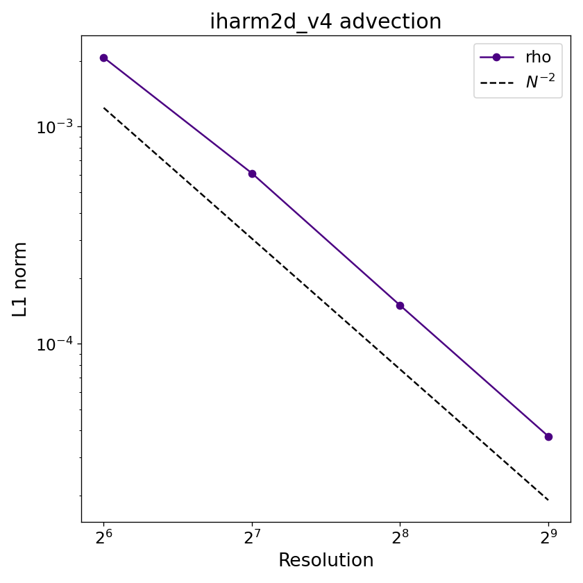

# Advection

## Overview

A smooth Gaussian density pulse sits in a uniform, constant-pressure background and is advected diagonally across a doubly-periodic box at constant velocity for exactly one domain-crossing time. By comparing the final profile to the initial condition at multiple resolutions, the test measures the numerical diffusion and convergence order of the spatial reconstruction, verifies mass and energy conservation, and the implementation of the periodic boundary conditions. However, because all magnetic field components are zero, the metric is flat, and the flow remains smooth throughout, the test does not exercise any aspect of the MHD or general relativistic sector, and says nothing about how well the code handles discontinuities and shocks.

## Setup

The domain is the unit square $[0,1]\times[0,1]$ in Minkowski coordinates with periodic boundaries on all four sides. The initial state is

$$
\rho(x,y) = 1 + A\,\exp\!\left(-\frac{(x-0.5)^2 + (y-0.5)^2}{r_{\rm sq}}\right),
\qquad u = 0.1,
$$

with a uniform 3-velocity of magnitude $v_{\rm init}$ directed along the box diagonal,

$$
v^x = v^y = \frac{v_{\rm init}}{\sqrt{2}},\qquad v^z = 0,\qquad \mathbf{B} = 0.
$$

Threfore, the corresponding fluid primtiives are $\tilde{u}^1=\gamma v^1,\,\tilde{u}^2=\gamma v^2$, where $\gamma = (1 - v_{\rm init}^2)^{-1/2}$ is the Lorentz factor. The final time is automatically set to $t_f = \sqrt{2}/v_{\rm init}$, i.e. exactly one diagonal crossing of the box, in `problem.c`, so the analytic solution at $t_f$ is identical to the initial condition.

## Parameters

Problem-specific runtime parameters are:

| Parameter | Meaning |
|---|---|
| `A`      | Amplitude of the Gaussian density perturbation |
| `r_sq`   | Squared width of the Gaussian, $r_{\rm sq}$ |
| `v_init` | Magnitude of the advection three-velocity |

Relevant compile-time parameters are: 

| Parameter | Default | Notes |
|---|---|---|
| `N1TOT`, `N2TOT`   | `128`       | Grid resolution; change for convergence study |
| `METRIC`           | `MINKOWSKI` | |
| `X{1,2}{L,R}_BOUND`| `PERIODIC`  | |

## Output and convergence

The video below shows $\rho$ over one full crossing at the default $128\times128$ resolution.

<video controls width="100%">   
  <source src="../../assets/advection_web.mp4" type="video/mp4">
</video>

A plotting script for individual dumps is provided at `prob/advection/plot_advection.py`.

Because the exact solution at $t_f$ equals the initial condition, the L1 error is simply

$$
L_1 = \frac{1}{N_1 N_2}\sum_{i,j}\left|\rho_{ij}(t_f) - \rho_{ij}(0)\right|.
$$

Below is the convergence plot with WENO reconstruction the expected slope is $L_1 \propto N^{-2}$.

## References

- [Gammie, McKinney & Tóth (2003)](https://ui.adsabs.harvard.edu/abs/2003ApJ...589..444G/abstract).
