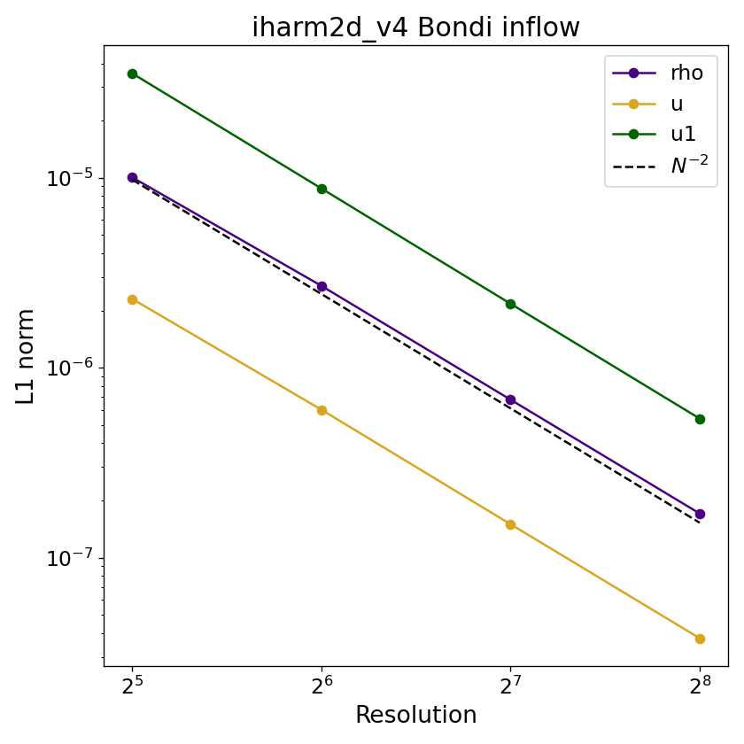

# Bondi accretion

## Overview

Spherically symmetric, radial accretion onto a Schwarzschild black hole. The relativistic Bondi solution ([Michel 1972](https://ui.adsabs.harvard.edu/abs/1972Ap%26SS..15..153M/abstract), [Hawley et al. 1984](https://ui.adsabs.harvard.edu/abs/1984ApJ...277..296H/abstract)) provides an exact steady-state for density, internal energy, and radial velocity as functions of radius, fully determined by the mass accretion rate $\dot{M}$ and the sonic radius $r_s$. The code is initialized with this analytic solution and evolved forward in time; because the solution is stationary, any deviation at the final dump is purely numerical error. This test uses a curved spacetime and exercises the GR sector of the code.

## Setup

The domain spans $[R_{\rm hor}, R_{\rm out}]$ radially and $[0, \pi]$ in polar angle, using Modified Kerr-Schild (MKS) coordinates with $a = 0$ (Schwarzschild). The analytic solution is characterized by two conserved constants,

$$
C_4 = r^2T^{N/2}u^r, \qquad C_3 = \left[1 + \bigg(1 + \frac{N}{2}\bigg)T\right]^2\!\left[1 - \frac{2}{r} + (u^r)^2\right],
$$
where $N = 2/(\Gamma-1)$ is the number of degrees of freedom, and $T$ is the dimensionless temperature ($\propto kT/mc^2$). These are fixed by the sonic conditions at $r = r_s$,

$$
u^r_s = \sqrt{\frac{1}{2r_s}}, \quad T_c = \frac{2N c_{s,c}^2}{(N+2)(2-Nc_{s,c}^2)}, \quad c_{s,c}=\frac{(u^r_c)^2}{1-3(u^r_c)^2},
$$
where $c_{s,c}$ is the sound speed at $r_s$. At each radius, $T(r)$ is obtained by Newton-Raphson root-finding of $C_3(r, T) - C_3 = 0$, then

$$
u^r = -\frac{C_4}{r^2 T^{N/2}}, \qquad \rho = K^{-N/2} T^{N/2}, \qquad u = \frac{\rho T}{\Gamma - 1},
$$

where $K = (4\pi C_4/\dot{m})^{1/n}$. The outer boundary applies the analytic solution at every timestep (`X1R_BOUND USER`); the inner boundary is outflow with no inflow enforced (`X1L_BOUND OUTFLOW`, `X1L_INFLOW 0`). There is no magnetic field.

## Parameters

Problem-specific runtime parameters are:

| Parameter | Meaning |
|---|---|
| `mdot` | Mass accretion rate $\dot{M}$ |
| `rs`   | Sonic radius |
| `Rhor` | Inner radial boundary (set slightly outside $r = 2M$) |

Relevant compile-time parameters are:

| Parameter | Default | Notes |
|---|---|---|
| `N1TOT`, `N2TOT`  | `64`      | Grid resolution; change for convergence study |
| `METRIC`          | `MKS`     | Modified Kerr-Schild |
| `RECONSTRUCTION`  | `WENO`    | |
| `X1L_BOUND`       | `OUTFLOW` | Inner radial boundary |
| `X1R_BOUND`       | `USER`    | Outer radial boundary — analytic Bondi solution |
| `X2L/R_BOUND`     | `POLAR`   | |
| `X1L_INFLOW`      | `0`       | No inflow at inner boundary |

## Convergence

Because the solution is stationary, the L1 error is computed by comparing the final dump to the initial dump for $\rho$, $u$, and $u^r$, excluding zones inside the event horizon,

$$
L_1(q) = \frac{1}{N_{\rm active}}\sum_{r_i > R_{\rm hor}}\left|q_{ij}(t_f) - q_{ij}(0)\right|.
$$

The errors in $\rho$, $u$, and $\tilde{u}^1$ exhibit the expected second-order convergence, $L_1 \propto N^{-2}$.

## References

- [Michel (1972)](https://ui.adsabs.harvard.edu/abs/1972Ap%26SS..15..153M/abstract) — relativistic Bondi solution.
- [Hawley et al. (1974)](https://ui.adsabs.harvard.edu/abs/1984ApJ...277..296H/abstract) - relativistic Bondi solution formulated in terms of thermodynamic quantities at sonic point instead of asymptotic values.
