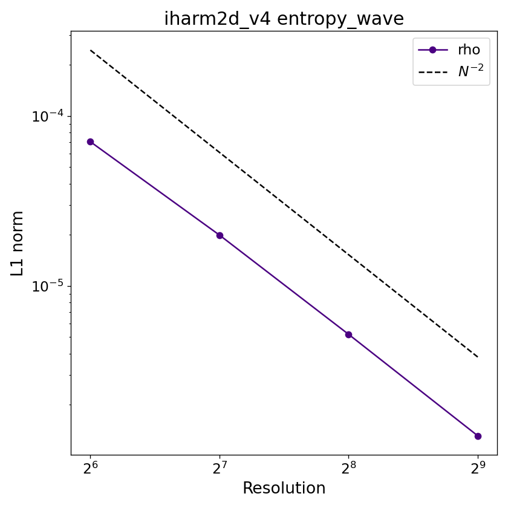

# Entropy wave

## Overview

A small-amplitude sinusoidal density perturbation propagates at 45° across a doubly-periodic box on a uniform background with no magnetic field. Because the perturbation is a pure entropy mode — there is no pressure perturbation and the magnetic field is zero — the wave simply advects with the background fluid velocity very similar to the 'advection' test. The analytic solution is known at all times making this a precise test of the code's ability to preserve linear wave structure over many crossing times. As with the advection test, this problem exercises only the hydrodynamic sector of the code.

## Setup

The domain is the unit square $[0,1]\times[0,1]$ in Minkowski coordinates with periodic boundaries on all four sides. The background state is uniform with $\rho_0 = 1$, $u_0 = 0.01$, and a bulk 3-velocity of magnitude $u_{10} = 0.1$ directed along the diagonal. The initial density perturbation is

$$
\rho(x,y,t=0) = \rho_0 + A\,\delta\rho\,\cos(k_1 x + k_2 y),
$$

where $A = 0.01$, $\delta\rho = 1$, and the wave-vector components are $k_1 = k_2 = 2\pi$ (one full wavelength along each axis, giving a diagonal wavelength $\lambda = 1/\sqrt{2}$). The background 3-velocity components are

$$
\tilde{u}^x = \tilde{u}^y = u_{10}\rm{cos}(\pi/4),\qquad \tilde{u}^z = 0,\qquad \mathbf{B} = 0,
$$
The analytic solution at time $t$ is

$$
\rho(x,y,t) = \rho_0 + A\,\delta\rho\,\cos\\bigl(k_1(x - v^x t) + k_2(y - v^y t)\bigr),
$$
where $\gamma = \sqrt{1 + u_{10}^2}$ is the Lorentz factor and $v^i=\tilde{u}^i/\gamma$. 

## Parameters

Relevant compile-time parameters are:

| Parameter | Default | Notes |
|---|---|---|
| `N1TOT`, `N2TOT`    | `256`       | Grid resolution; change for convergence study |
| `METRIC`            | `MINKOWSKI` | |
| `RECONSTRUCTION`    | `LINEAR`    | |
| `X{1,2}{L,R}_BOUND` | `PERIODIC`  | |

## Output and convergence

The video below shows $\rho$ over the run at the default $256\times256$ resolution.

<!-- TODO: embed entropy wave video -->

A plotting script for individual dumps is provided at `prob/entropy_wave/plot_entropy_wave.py`.

Because the analytic solution is known at all times, the L1 error at the final dump is

$$
L_1 = \frac{1}{N_1 N_2}\sum_{i,j}\left|\rho_{ij}(t_f) - \rho^{\rm exact}_{ij}(t_f)\right|.
$$

Below is the convergence plot with `LINEAR` reconstruction; the expected slope is $L_1 \propto N^{-2}$.

