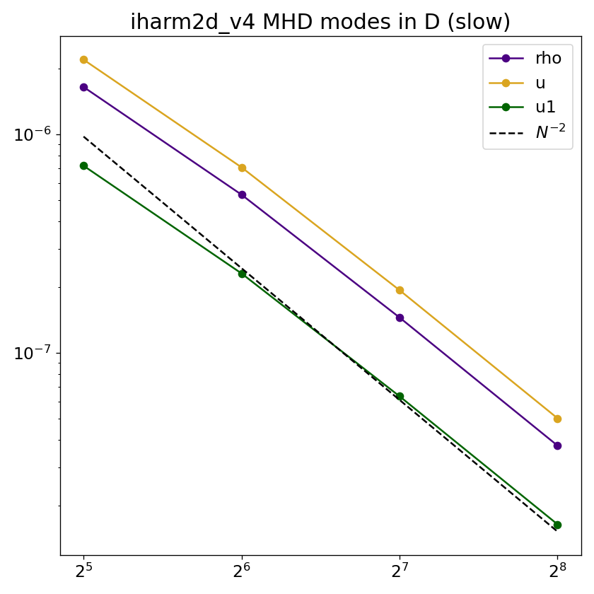
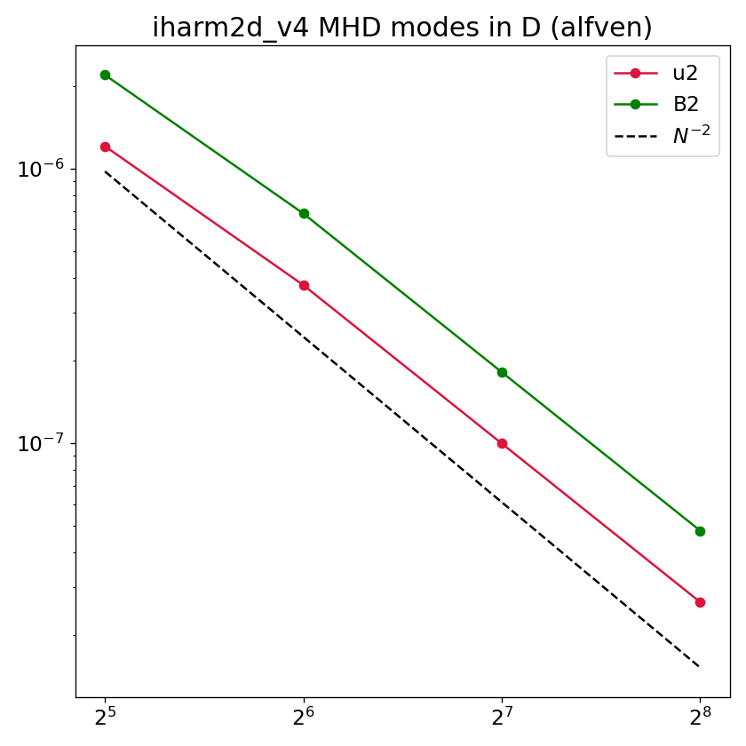
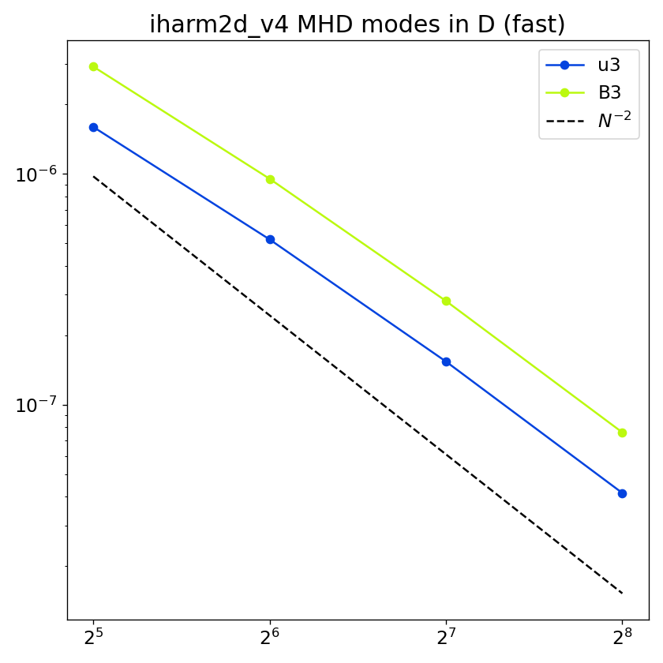

# Linear MHD modes (1D)

## Overview

Four linear MHD eigenmodes — entropy, slow, Alfvén, and fast — are initialized as small-amplitude sinusoidal perturbations propagating along one coordinate axis through a magnetized background. Selecting `nmode` chooses which eigenmode is excited; selecting `idim` sets the propagation direction. Because the wave propagates strictly along a coordinate axis aligned with the background magnetic field, this is a 1D problem: the grid collapses to a single strip of cells (not counting ghost zones; $N_2 = 1$ for `idim=1`, $N_1 = 1$ for `idim=2`). All eight primitives are tracked, and the analytic solution is known at all times, making this a precise test of the MHD wave speeds and the accuracy with which the code propagates each mode individually.

## Setup

The domain is the unit square $[0,1]\times[0,1]$ in Minkowski coordinates with periodic boundaries. The background state is

$$
\rho_0 = 1,\quad u_0 = 1,\quad \mathbf{B}_0 = 1\hat{e}_{\rm idim},\quad \tilde{u}^i_0 = 0,
$$

where $\hat{e}_{\rm idim}$ is the unit vector along the propagation axis (`idim=1` $\Rightarrow$ $\hat{x}$, `idim=2` $\Rightarrow$ $\hat{y}$), i.e. the field is aligned with the propagation direction. The initial state is

$$
q(x,t=0) = q_0 + A\,\delta q\,\cos(k\,x_{\rm idim}),
$$

with amplitude $A = 10^{-4}$ and $k = 2\pi$ (one wavelength in the box). The perturbation eigenvector $\delta q$ for each mode is:

| `nmode` | Mode | Perturbed variables | $\lvert\omega\rvert$ |
|---|---|---|---|
| 0 | Entropy | $\delta\rho$ only | $t_f$ |
| 1 | Slow | $\delta\rho,\,\delta u,\,\delta\tilde{u}_{\parallel}$ | $2.742$ |
| 2 | Alfvén | $\delta\tilde{u}_{\perp}^{(1)},\,\delta B_{\perp}^{(1)}$ | $3.441$ |
| 3 | Fast | $\delta\tilde{u}_{\perp}^{(2)},\,\delta B_{\perp}^{(2)}$ | $3.441$ |

where $\parallel$ denotes the propagation direction and $\perp^{(1,2)}$ denote the two transverse directions. The final time is set automatically to one full wave period $t_f = 2\pi/|\omega|$. The frequencies are evaluated for the given background state above with $k = 2\pi\sqrt{2}$ and adiabatic index $\Gamma = 4/3$. Note that the Alfvén and fast modes are degenerate for propagation along $\mathbf{B}$.

## Parameters

Problem-specific runtime parameters are:

| Parameter | Meaning |
|---|---|
| `nmode` | Eigenmode: `0`=entropy, `1`=slow, `2`=Alfvén, `3`=fast |
| `idim`  | Propagation direction: `1`=x1, `2`=x2 |

Relevant compile-time parameters are:

| Parameter | Default | Notes |
|---|---|---|
| `N1TOT`             | `64`        | Set to $N$, keep `N2TOT=1` when `idim=1`; swap for `idim=2` |
| `N2TOT`             | `1`         | Set to $N$, keep `N1TOT=1` when `idim=2`; swap for `idim=1` |
| `METRIC`            | `MINKOWSKI` | |
| `RECONSTRUCTION`    | `LINEAR`    | |
| `X{1,2}{L,R}_BOUND` | `PERIODIC`  | |

## Convergence

Because `tf` is set to exactly one wave period, the analytic solution at $t_f$ equals the initial eigenmode. The L1 error for each primitive $q$ is

$$
L_1(q) = \frac{1}{N}\sum_{i}\left|q_i(t_f) - q_0 - A\,\delta q\,\cos(k\,x_i)\right|,
$$

where $q_0$ is the background value and only primitives with $\delta q \neq 0$ for the selected mode are included. The expected slope is $L_1 \propto N^{-2}$ as shown below,

  
  
  

## References

- [Gammie, McKinney & Tóth (2003)](https://ui.adsabs.harvard.edu/abs/2003ApJ...589..444G/abstract).
