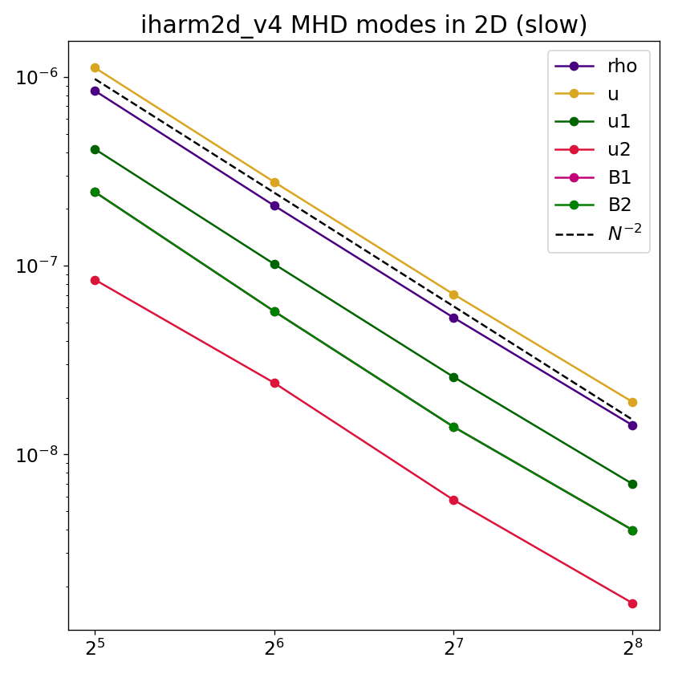
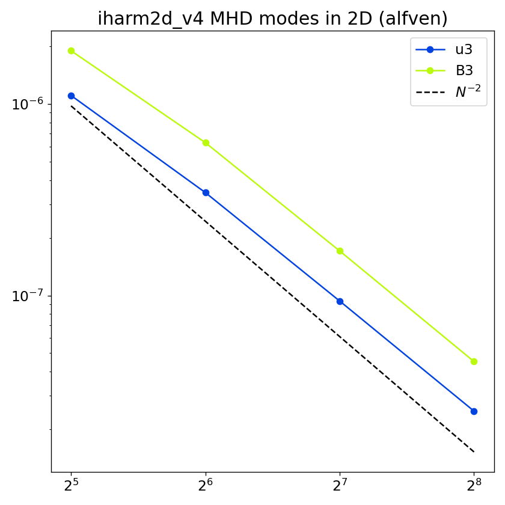
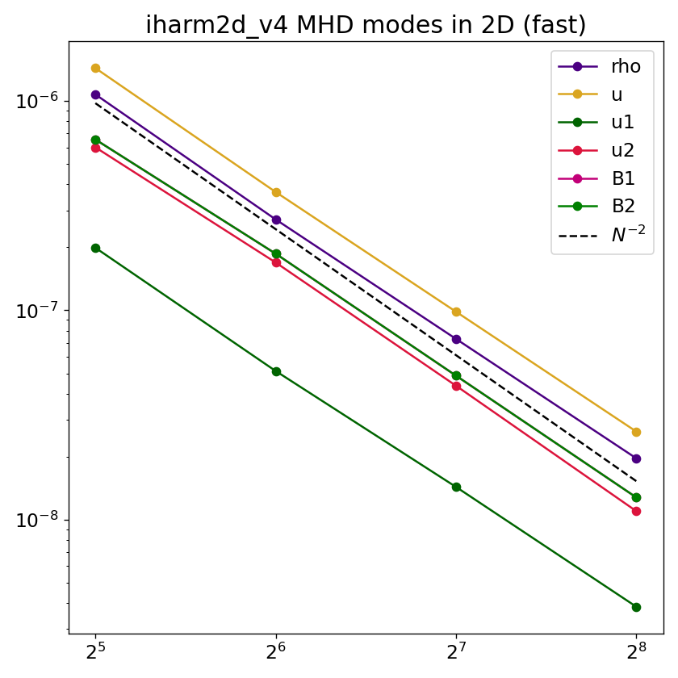

# Linear MHD modes (2D)

## Overview

The same four MHD eigenmodes as in the 1D test are initialized here as small-amplitude sinusoidal perturbations propagating obliquely at 45° through a magnetized background. Unlike the 1D test where propagation is along $\mathbf{B}$, here the oblique geometry breaks the degeneracy between the Alfvén and fast speeds, so all three modes propagate at different speeds. It also means the slow and fast eigenvectors simultaneously perturb density, internal energy, both in-plane velocity components, and both in-plane magnetic field components. This makes the 2D test a more stringent check of the code. The analytic solution is known at all times, and the test exercises multi-dimensional MHD transport as well as the flux-CT update of the magnetic field.

## Setup

The domain is the unit square $[0,1]\times[0,1]$ in Minkowski coordinates with periodic boundaries. The background state is

$$
\rho_0 = 1,\quad u_0 = 1,\quad \mathbf{B}_0 = \hat{x},\quad \tilde{u}^i_0 = 0,
$$

with the wave propagating at 45° to the field. The initial state is

$$
q(x,y,t=0) = q_0 + A\,\delta q\,\cos(k_1 x + k_2 y),
$$

with amplitude $A = 10^{-4}$ and $k_1 = k_2 = 2\pi$ (one wavelength along each axis, diagonal wavelength $\lambda = 1/\sqrt{2}$). The perturbation eigenvector $\delta q$ for each mode is:

| `nmode` | Mode | Perturbed variables | $\lvert\omega\rvert$ |
|---|---|---|---|
| 0 | Entropy | $\delta\rho$ | $t_f$ |
| 1 | Slow    | $\delta\rho,\,\delta u,\,\delta\tilde{u}^{1,2},\,\delta B^{1,2}$ | $2.410$ |
| 2 | Alfvén  | $\delta\tilde{u}^3,\,\delta B^3$ | $3.441$ |
| 3 | Fast    | $\delta\rho,\,\delta u,\,\delta\tilde{u}^{1,2},\,\delta B^{1,2}$ | $5.537$ |

The final time is set automatically to one full wave period $t_f = 2\pi/\lvert\omega\rvert$ for each mode. The frequencies are evaluated for the given background state above with $k = 2\pi\sqrt{2}$ and adiabatic index $\Gamma = 4/3$.

## Parameters

Problem-specific runtime parameters are:

| Parameter | Meaning |
|---|---|
| `nmode` | Eigenmode: `0`=entropy, `1`=slow, `2`=Alfvén, `3`=fast |

Relevant compile-time parameters are:

| Parameter | Default | Notes |
|---|---|---|
| `N1TOT`, `N2TOT`    | `64`        | Grid resolution; change for convergence study |
| `METRIC`            | `MINKOWSKI` | |
| `RECONSTRUCTION`    | `LINEAR`    | |
| `X{1,2}{L,R}_BOUND` | `PERIODIC`  | |

## Convergence

Because `tf` is set to exactly one wave period, the analytic solution at $t_f$ equals the initial eigenmode. The L1 error for each primitive $q$ is

$$
L_1(q) = \frac{1}{N_1 N_2}\sum_{i,j}\left|q_{ij}(t_f) - q_0 - A\,\delta q\,\cos(k_1 x_i + k_2 y_j)\right|,
$$

where $q_0$ is the background value and only primitives with $\delta q \neq 0$ for the selected mode are included. The expected slope is $L_1 \propto N^{-2}$ as shown below,

  
  
  

## References

- [Gammie, McKinney & Tóth (2003)](https://ui.adsabs.harvard.edu/abs/2003ApJ...589..444G/abstract).
