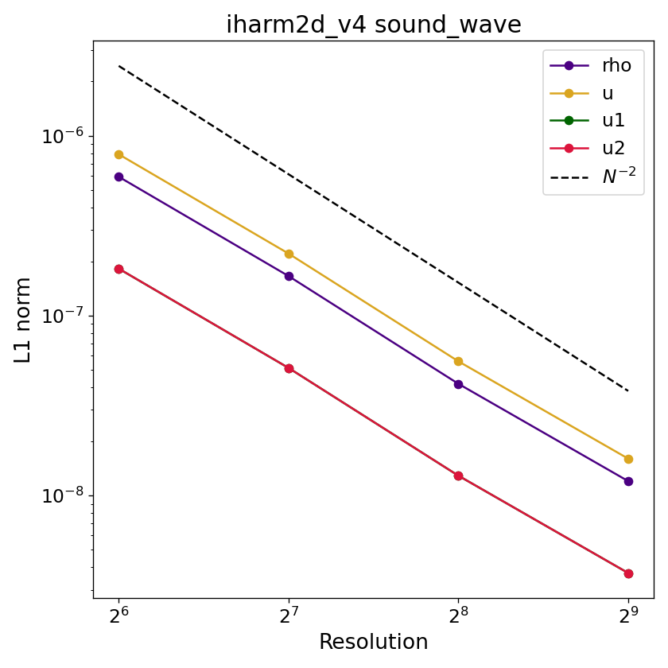

# Sound wave

## Overview

A small-amplitude sound wave propagates at 45° across a doubly-periodic box through a fluid at rest. The perturbation is an acoustic eigenmode — density, internal energy, and velocity are all perturbed simultaneously according to the linearized relativistic Euler equations, and the wave propagates at the relativistic sound speed $c_s$ with no background velocity. The analytic solution is known at all times, making this a test of the code's ability to correctly propagate compressive waves and maintain the proper phase speed over one full wave period.

## Setup

The domain is the unit square $[0,1]\times[0,1]$ in Minkowski coordinates with periodic boundaries on all four sides. The background state is a fluid at rest with $\rho_0 = 1$, $u_0 = 1$, $\tilde{u}^i = 0$, and adiabatic index $\Gamma = 4/3$. The sound speed of the background is

$$
c_s = \sqrt{\frac{\Gamma p_0}{\rho_0 h_0}}, \qquad p_0 = (\Gamma-1)u_0,\qquad h_0 = 1 + \frac{u_0 + p_0}{\rho_0}.
$$

The initial perturbations to all fluid variables are set to the left-propagating acoustic eigenmode,

$$
\delta\rho = A\,\sqrt{\tfrac{63}{187}},\quad \delta u = A\,\sqrt{\tfrac{112}{187}},\quad \delta\tilde{u}^x = A\,\sqrt{\tfrac{12}{187}}\cos(\pi/4),\quad \delta\tilde{u}^y = A\,\sqrt{\tfrac{12}{187}}\sin(\pi/4),\quad \mathbf{B} = 0,
$$

where $A = 10^{-4}$, superimposed as a cosine wave propagating at 45°,

$$
q(x,y,t=0) = q_0 + \delta q\,\cos(k_1 x + k_2 y),
$$

with $k_1 = k_2 = 2\pi$ (one full wavelength along each axis). The analytic solution at time $t$ is

$$
q(x,y,t) = q_0 + \delta q\,\cos\!\bigl(k_1(x - v_p^x\, t) + k_2(y - v_p^y\, t)\bigr),
$$

where $v_p^x = v_p^y = c_s/\sqrt{2}$ are the phase velocity components. The final time $t_f \approx 1.62$ corresponds to exactly one full wave period.

## Parameters

Relevant compile-time parameters are:

| Parameter | Default | Notes |
|---|---|---|
| `N1TOT`, `N2TOT`    | `256`       | Grid resolution; change for convergence study |
| `METRIC`            | `MINKOWSKI` | |
| `RECONSTRUCTION`    | `LINEAR`    | |
| `X{1,2}{L,R}_BOUND` | `PERIODIC`  | |

## Output and convergence

The video below shows $\rho$ over one full wave period at the default $256\times256$ resolution.

<video controls width="100%">
  <source src="../../assets/sound_wave.mp4" type="video/mp4">
</video>

A plotting script for individual dumps is provided at `prob/sound_wave/plot_sound_wave.py`.

Because the analytic solution is known at all times, the L1 error is computed for all four perturbed primitives ($\rho$, $u$, $\tilde{u}^x$, $\tilde{u}^y$) at the final dump.

Below is the convergence plot with `LINEAR` reconstruction; the expected slope is $L_1 \propto N^{-2}$.

