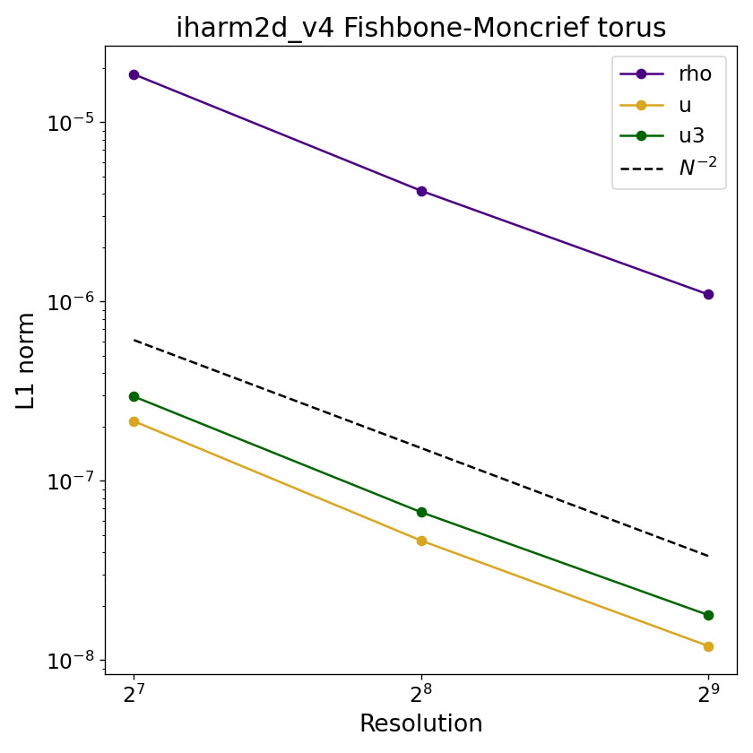

# Fishbone-Moncrief torus equilibrium

## Overview

The Fishbone-Moncrief (FM) torus is an analytic equilibrium solution for a rotating fluid torus around a Kerr black hole, with constant specific angular momentum and a polytropic equation of state. The code is initialized with this solution and evolved with no magnetic field and no perturbation (`u_jitter=0`); since the torus is in exact equilibrium, any deviation at the final dump is purely numerical. We run this test in Funky Modified Kerr-Schild (FMKS) coordinates around a rapidly rotating black hole ($a=0.9375$), which simultaneously validates the FMKS implementation, the FM solution implementation, and the full GR machinery, including metric connections and the coordinate transforms to Boyer-Lindquist form needed to evaluate the FM solution.

## Setup

The domain spans $[R_{\rm hor}, R_{\rm out}]$ radially and $[0,\pi]$ in polar angle, using FMKS coordinates (`METRIC MKS`, `DEREFINE_POLES 1`). The torus is bounded between the inner edge $r_{\rm in}$ and an outer surface defined by the enthalpy contour. The specific angular momentum is constant throughout the torus and fixed to its Keplerian value at the pressure maximum $r_{\rm max}$ (Fishbone & Moncrief 1976, eq. 3.8). The enthalpy at each point is obtained from the Bernoulli equation (eq. 3.6), and the density and internal energy follow from the polytropic relation,

$$
\rho = \left[\frac{(h-1)(\Gamma-1)}{\kappa\,\Gamma}\right]^{1/(\Gamma-1)},\qquad u = \frac{\kappa\,\rho^\Gamma}{\Gamma-1},
$$

with $\kappa = 10^{-3}$ and $\Gamma = 4/3$. The fluid has only azimuthal motion ($u^r = u^\theta = 0$); $u^\phi$ is computed from the FM angular momentum equation (eq. 3.3). Zones outside the torus are set to floor values. Densities are normalized so that $\max(\rho) = 1$ at initialization.

## Parameters

Problem-specific runtime parameters are:

| Parameter | Meaning |
|---|---|
| `rin`      | Inner edge of the torus |
| `rmax`     | Radius of pressure maximum |
| `u_jitter` | Amplitude of random internal energy perturbation; set to `0` for equilibrium test |

Relevant compile-time and runtime parameters are:

| Parameter | Default | Notes |
|---|---|---|
| `N1TOT`, `N2TOT`  | `128`     | Grid resolution; change for convergence study |
| `METRIC`          | `MKS`     | |
| `DEREFINE_POLES`  | `1`       | Enables FMKS (pole-derefined) coordinates |
| `RECONSTRUCTION`  | `WENO`    | |
| `a`               | `0.9375`  | Black hole spin (runtime parameter) |
| `X1L/R_BOUND`     | `OUTFLOW` | |
| `X2L/R_BOUND`     | `POLAR`   | |

## Convergence

Because the torus is initialized in exact equilibrium, the L1 error is computed by comparing the final dump to the initial dump for $\rho$, $u$, and $\tilde{u}^3$ (azimuthal velocity). Only zones with $\rho > 0.02$ (i.e. inside the torus body, away from the floor-dominated atmosphere) are included,

$$
L_1(q) = \frac{1}{N_{\rm torus}}\sum_{\rho_{ij}(0) > 0.02}\left|q_{ij}(t_f) - q_{ij}(0)\right|.
$$

The errors in $\rho$, $u$, and $\tilde{u}^3$ exhibit the expected second-order convergence, $L_1 \propto N^{-2}$.

## References

- [Fishbone & Moncrief (1976)](https://ui.adsabs.harvard.edu/abs/1976ApJ...207..962F/abstract) — analytic torus equilibrium solution.